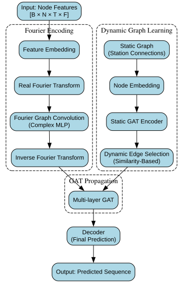

# Graph Fourier Network (GFN)

Official PyTorch implementation for **_"A Graph Fourier-Based Deep Learning Model to Predict Regional Groundwater Level Variations with Hydrogeological and Spatio-Temporal Interpretability"_**.

## Features
- Unified integration of **Fourier Neural Networks (FNN)** and **Graph Attention Networks (GATLayer)**.
- **Dynamic Graph Learner (DGL)** module for adaptive spatial structure learning.
- Supports multiple meteorological drivers: *precipitation*, *temperature*, *NDVI*, *evapotranspiration*.
- Enhanced spatiotemporal interpretability via **gradient sensitivity** and **SHAP analysis**.

## Installation
```bash
# Clone the repository
git clone https://github.com/xjtu-gwdg/GraphFourierNet.git
cd GraphFourierNet

# Install required packages
pip install -r requirements.txt
```

**Requirements:**
- torch==2.5.1
- torch_geometric==2.6.1
- numpy==2.2.3
- pandas==2.2.3
- scikit_learn==1.6.1
- matplotlib==3.10.1
- seaborn==0.13.2
- shap==0.47.0
- tqdm==4.67.1
- joblib==1.4.2


## Dataset Preparation
1. Create the directory `data/YRB/`
2. Place **station-wise Excel files** under `data/YRB/`
3. Each `.xlsx` file should contain the following columns:
   - `yearcol`, `monthcol`, `daycol`
   - `pre` (precipitation)
   - `tmp` (temperature)
   - `ndvi` (vegetation index)
   - `et` (evapotranspiration)
   - `sw` (target groundwater level, GWL)


## Training
```bash
python main.py \
  --data YRB \
  --seq_len 6 \
  --pred_len 5 \
  --batch_size 8 \
  --epochs 200 \
  --lr 0.5 \
  --gat_hidden 256 \
  --gat_heads 4
```


## Testing
```bash
python main.py --test --data YRB
```


## Main Configuration Options

| Argument            | Description                                   | Default |
|---------------------|-----------------------------------------------|---------|
| `--data`            | Dataset name                                | YRB     |
| `--seq_len`         | Input sequence length (historical window)    | 6       |
| `--pred_len`        | Prediction horizon (future steps)            | 5       |
| `--feat_dim`        | Number of input features                     | 5       |
| `--batch_size`      | Batch size for training                     | 8       |
| `--epochs`          | Number of training epochs                   | 200     |
| `--lr`              | Initial learning rate                       | 0.5     |
| `--gat_hidden`      | Hidden size for GAT layers                   | 256     |
| `--gat_heads`       | Number of heads in GAT                      | 4       |
| `--gat_layers`      | Number of stacked GAT layers                | 1       |
| `--dropout`         | Dropout rate                                | 0.5     |
| `--edge_keep_ratio` | Top-K percentage for dynamic edge selection  | 0.4     |
| `--train_ratio`     | Train set split ratio                        | 0.7     |
| `--val_ratio`       | Validation set split ratio                  | 0.2     |


## Model Architecture

### 1. Fourier Neural Network (FNN)
- Frequency-domain modeling of temporal dynamics.
- Two-layer complex-valued transformation in the Fourier domain.
- Real-Imaginary recombination with inverse FFT back to time domain.

### 2. Graph Attention Networks (GATLayer)
- Multi-head self-attention over neighboring nodes.
- Residual connections and layer normalization for stability.
- Supports **grouped softmax** based on target nodes.

### 3. Dynamic Graph Learner (DGL)
- Learns new edges based on node embeddings.
- Combines **static HGU-based graphs** with **dynamic edges**.
- Edge scoring network with trainable similarity predictor.

### 4. Final Decoder
- Fully connected layers with **LayerNorm** + **ELU** + **Dropout** for robust forecasting.


## Overall Model Flow



## Model Interpretability

- **Spatiotemporal Feature SHAP Analysis**:  
  Analyze contributions of different meteorological drivers (*precipitation*, *temperature*, *NDVI*, *evapotranspiration*) across multiple **time steps**, providing fine-grained temporal interpretability.

- **Spatial Graph SHAP Analysis**:  
  Introduce a custom **Monte Carlo-based Edge SHAP method** to quantify the importance of **nodes** and **edges** within the dynamically learned graph structure, enabling spatial interpretability of groundwater interactions.

> ✨ This dual-stage SHAP framework enhances interpretability at both the feature-time dimension and the spatial graph dimension.


## Acknowledgements
This research builds upon:
- [Graph Attention Networks (GAT)](https://github.com/PetarV-/GAT)
- [FourierGNN](https://github.com/aikunyi/FourierGNN)
- [SHAP](https://github.com/shap/shap)


---

Made with ❤️ by xjtu-gwdg Team.